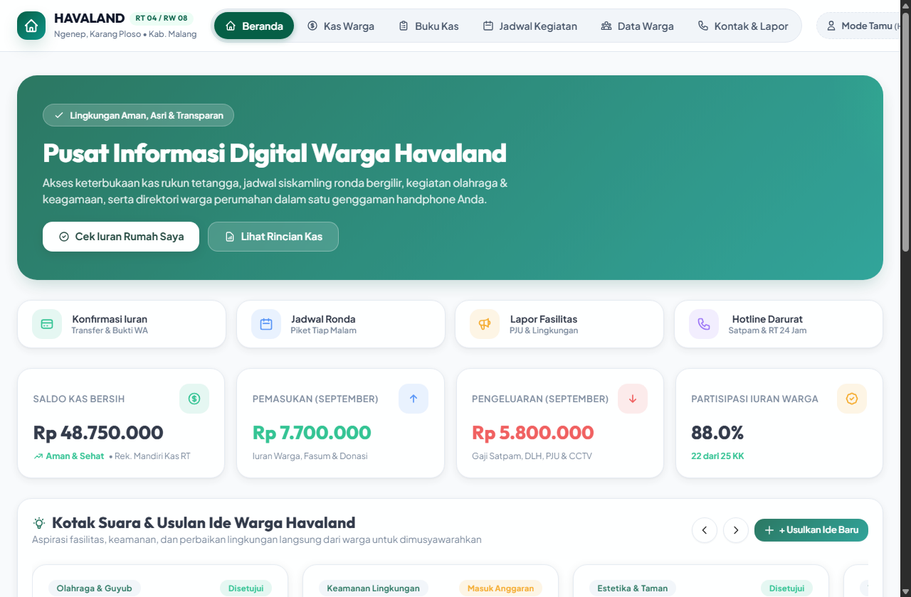
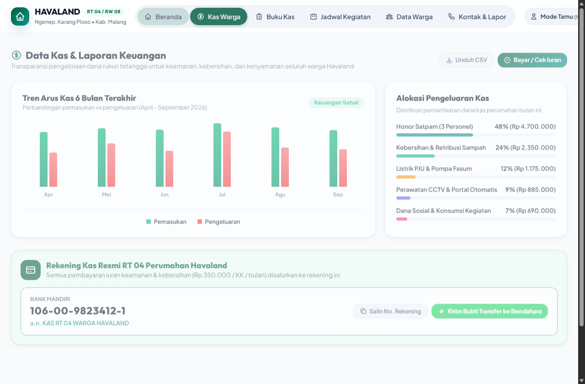
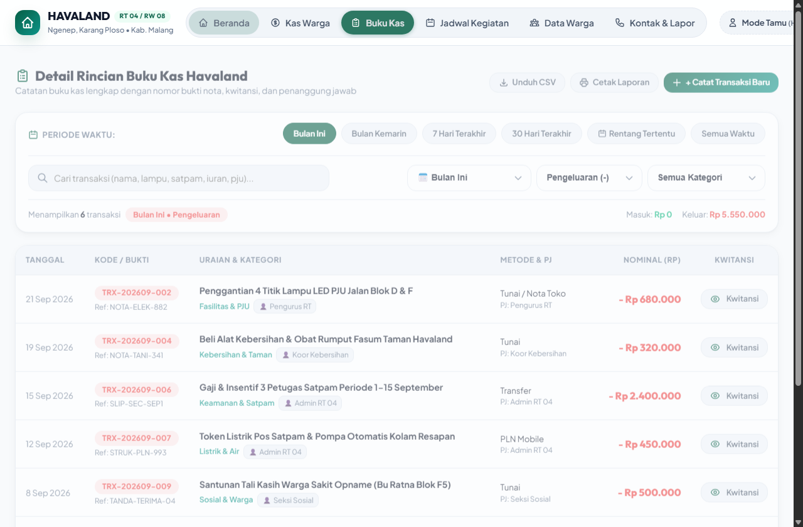
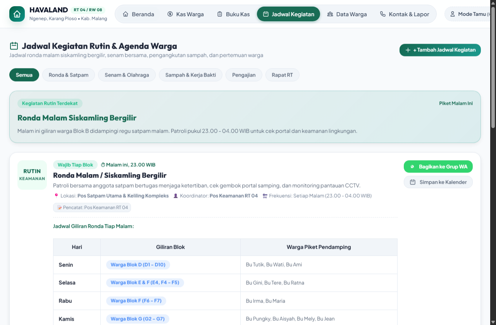
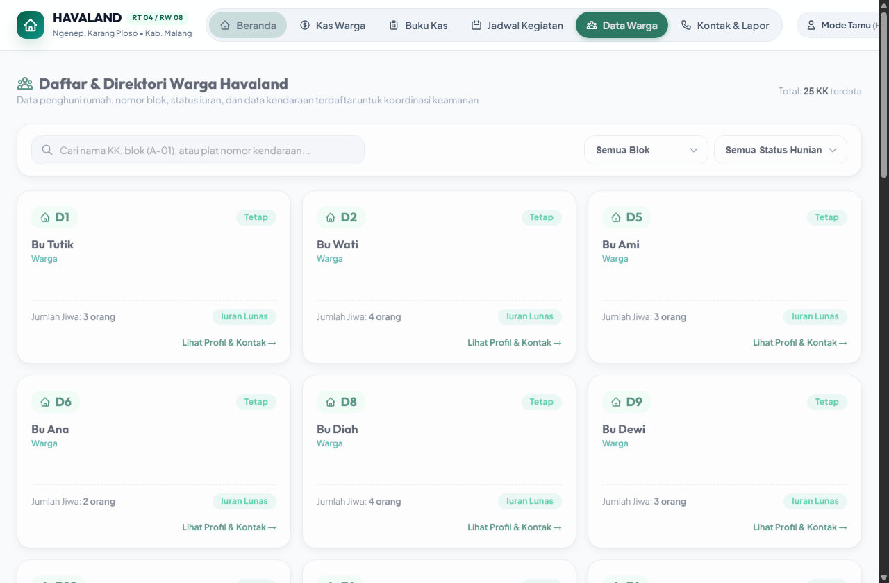
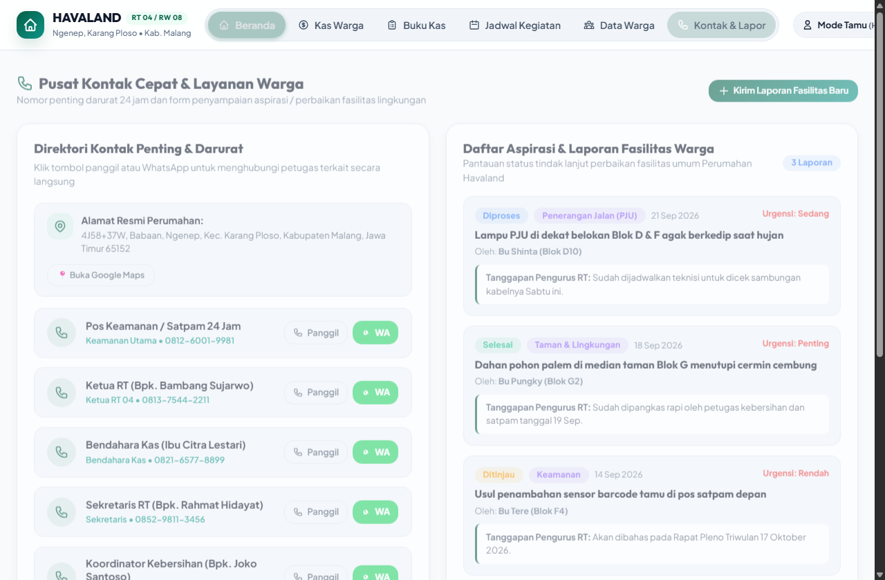

# 🏡 Portal Informasi Warga Perumahan Havaland (RT 04 / RW 08)

<div align="center">

[](https://warga-havaland.vercel.app)
[](LICENSE)
[](package.json)
[](https://warga-havaland.vercel.app)

**Website Resmi Komunitas & Transparansi Keuangan Warga Perumahan Havaland**  
*Alamat: 4J58+37W, Babaan, Ngenep, Kec. Karang Ploso, Kabupaten Malang, Jawa Timur 65152*

[🌐 Kunjungi Website Live (warga-havaland.vercel.app)](https://warga-havaland.vercel.app) • [📖 Panduan Database Vercel](PANDUAN_VERCEL_DATABASE.md)

</div>

---

## 📖 Tentang Aplikasi

**Portal Warga Havaland** adalah platform informasi komunitas terpadu berbasis web yang dirancang khusus untuk mewujudkan **lingkungan perumahan yang aman, asri, guyub, dan transparan**. 

Aplikasi ini memberikan kemudahan bagi seluruh warga RT 04 / RW 08 untuk memantau arus keuangan kas rukun tetangga, mengecek status iuran bulanan rumah masing-masing, melihat jadwal ronda malam dan kerja bakti, menyampaikan aspirasi atau laporan kerusakan fasilitas, serta mengakses kontak darurat 24 jam dalam satu genggaman layar ponsel pintar maupun laptop.

---

## 📸 Galeri Tampilan Antarmuka (Screenshots)

Berikut tangkapan layar tampilan nyata dari sistem website sebelum Anda mengunduh repositori ini:

### 1. Dashboard Beranda & Ringkasan Lingkungan
> Ringkasan saldo kas bersih, pemasukan, pengeluaran, persentase partisipasi iuran warga, dan usulan ide fasilitas.


---

### 2. Grafik Tren Arus Kas & Alokasi Anggaran
> Visualisasi grafik tren kas 6 bulan terakhir, distribusi pengeluaran operasional (Satpam, Sampah, Listrik PJU), dan rekening resmi kas RT Mandiri.


---

### 3. Buku Kas Transparan & Filter Transaksi
> Catatan mutasi keuangan lengkap masuk dan keluar, filter pencarian, filter kategori, bukti nomor kwitansi/nota, dan tombol ekspor CSV.


---

### 4. Jadwal Kegiatan, Siskamling & Agenda Rutin
> Jadwal ronda malam bergilir, senam sehat Minggu pagi, kerja bakti lingkungan, pengangkutan sampah, hingga rapat pleno triwulanan.


---

### 5. Direktori Data 25 KK Warga Havaland
> Direktori penghuni perumahan, filter blok (Blok D, E, F, G, H, I, J), status hunian (Tetap/Kontrak/Kosong), kontak, plat nomor terdaftar, dan status pembayaran iuran.


---

### 6. Pusat Kontak Cepat Darurat & Lapor Fasilitas
> Hotline darurat satpam 24 jam, pengurus RT, Polsek Karang Ploso, Damkar, Puskesmas, peta perumahan, serta daftar aspirasi & tindak lanjut perbaikan fasilitas warga.


---

## ✨ Fitur-Fitur Unggulan

### 💰 1. Transparansi Kas & Keuangan Real-Time
- **Ringkasan KPI Keuangan**: Saldo bersih, total pemasukan, dan pengeluaran bulan berjalan.
- **Grafik Tren 6 Bulan**: Visualisasi rasio pemasukan vs pengeluaran yang interaktif.
- **Buku Kas Detail**: Pencatatan riwayat transaksi dengan kategori, metode transfer, penanggung jawab, dan nomor bukti.
- **Ekspor CSV & Cetak Kwitansi**: Cetak kuitansi resmi atau unduh rekapitulasi pembukuan kas bulanan ke Excel/CSV.

### 🏠 2. Cek & Konfirmasi Iuran Rumah Sendiri
- **Pencarian Cepat Rumah**: Filter per blok rumah dan pilih nomor rumah warga.
- **Status Pembayaran Terverifikasi**: Mengetahui apakah rumah Anda sudah lunas atau belum untuk bulan berjalan.
- **Konfirmasi WhatsApp Seketika**: Template pesan otomatis ke WhatsApp Bendahara lengkap dengan nominal dan data blok rumah.

### 👥 3. Direktori Data Warga & Kendaraan
- Direktori 25 Kepala Keluarga (KK) Perumahan Havaland (Blok D1 hingga J10).
- Pencatatan nomor plat kendaraan bermotor untuk pengamanan akses masuk portal perumahan.
- Filter dinamis berdasarkan Blok dan Status Hunian (Warga Tetap / Rumah Kontrak / Kosong).

### 🛡️ 4. Keamanan & Multi-Role (RBAC)
Sistem memiliki 4 tingkatan hak akses berbasis peran yang terlindungi:
1. **Mode Tamu (Tanpa Login)**: Akses *Read-Only* aman untuk membaca transparansi kas dan direktori perumahan.
2. **Warga Tetap**: Dapat mengirim usulan inovasi lingkungan, voting ide, dan lapor perbaikan fasilitas.
3. **Pengurus RT**: Memperbarui agenda siskamling & kegiatan serta memberikan tanggapan resmi pada aspirasi warga.
4. **Bendahara RT**: Mencatat transaksi arus kas masuk/keluar dan memverifikasi iuran warga.
5. **Administrator RT (`admin`)**: Akses kendali penuh (**CRUD**) untuk menambah, mengedit, dan menghapus seluruh konten (Warga, Kontak Darurat, Laporan, Jadwal, Buku Kas) serta menambah/mengelola akun warga baru.

### ♿ 5. Aksesibilitas & Tampilan Fleksibel
- **Dark Mode & Light Mode**: Peralihan tema gelap/terang yang ramah mata.
- **Pengaturan Ukuran Tulisan & Tombol Terpisah**: Pilihan skala teks (90% - 125%) dan ukuran tombol/ikon sentuh terpisah untuk kenyamanan pengguna lanjut usia.
- **Desain Responsif**: Tampilan rapi dan simetris di ponsel pintar (Android/iOS), tablet, hingga layar monitor desktop.

---

## 🛠️ Arsitektur & Teknologi

- **Frontend**: HTML5 Semantik, Vanilla CSS3 (Custom Design Tokens, Glassmorphism, CSS Grid & Flexbox), Vanilla JavaScript (ES6+ Module Architecture).
- **Backend API**: Vercel Serverless Functions (`/api/*`), Node.js `http`/`crypto`.
- **Database Support**: PostgreSQL (Vercel Postgres / Supabase) dengan fallback cerdas `LocalStorage` saat offline/lokal.
- **Keamanan**: Hash password SHA-256, HTTP Security Headers (CSP, HSTS, X-Frame-Options DENY, X-Content-Type-Options nosniff), Proteksi SQL Parameterized Queries.

---

## 🚀 Panduan Menjalankan Secara Lokal (Local Setup)

Untuk menjalankan proyek ini di komputer lokal Anda:

### 1. Clone Repositori
```bash
git clone https://github.com/siput-bersenjata/Warga-Havaland.git
cd Warga-Havaland
```

### 2. Jalankan Web Server Lokal
Karena proyek ini berbasis frontend ringan tanpa kompilasi rumit, Anda dapat menjalankannya dengan salah satu cara berikut:

**Menggunakan Node.js:**
```bash
npx serve .
# Atau jika menggunakan python:
python -m http.server 3000
```

Buka peramban Anda di: `http://localhost:3000`

---

## 🔑 Kredensial Akun Default (Administrator)

Untuk menguji fitur kelola data, menambah warga baru, mengedit kontak darurat, dan manajemen akun:

| Parameter | Kredensial |
|---|---|
| **Username** | `admin` |
| **Password** | `Amalia2125` |
| **Role** | `Administrator RT` (Akses Penuh / Full CRUD) |

---

## 📂 Struktur Direktori Proyek

```plaintext
Warga-Havaland/
├── api/                        # Vercel Serverless API Functions
│   ├── auth/login.js           # API Login & Verifikasi Password Hash
│   ├── middleware/auth.js      # Middleware Autentikasi & Validasi Token
│   ├── aspirasi.js             # API Laporan & Aspirasi Fasilitas Warga
│   ├── data.js                 # API Sinkronisasi Ringkasan Data
│   ├── db.js                   # Modul Koneksi PostgreSQL Client Pool
│   ├── init-db.js              # Inisialisasi Skema & Seeding Non-Destructive
│   ├── transaksi.js            # API Catatan Transaksi Buku Kas
│   ├── users.js                # API Manajemen Akun Pengguna Dinamis
│   └── warga.js                # API Data Direktori 25 Warga Havaland
├── assets/                     # Tangkapan Layar & Media Dokumentasi
│   ├── preview-beranda.png
│   ├── preview-buku-kas.png
│   ├── preview-transaksi-kas.png
│   ├── preview-jadwal-kegiatan.png
│   ├── preview-data-warga.png
│   └── preview-kontak-lapor.png
├── css/                        # Lembar Gaya Desain (CSS Tokens & Components)
│   ├── style.css               # Tema, Reset, Grid & Layout Responsif
│   └── components.css          # Desain Card, Button, Navbar, Pill, Modal
├── js/                         # Logika Aplikasi Web
│   ├── app.js                  # Controller Utama, RBAC, State Management & Filter
│   ├── data.js                 # Data Model Asli 25 Warga, Kegiatan & Kontak
│   └── utils.js                # Helper Rupiah, Format Tanggal, Storage & CSV
├── index.html                  # Halaman Utama Portal Aplikasi Web
├── package.json                # Konfigurasi Dependensi & Metadata Proyek
├── schema.sql                  # Skema DDL Database PostgreSQL & Seeding Data
├── vercel.json                 # Konfigurasi Routing & Header Keamanan Vercel
├── PANDUAN_VERCEL_DATABASE.md  # Panduan Lengkap Koneksi Database Cloud
└── README.md                   # Dokumentasi Utama Repositori
```

---

## 📄 Lisensi

Proyek ini dirilis di bawah lisensi [MIT License](LICENSE). Bebas digunakan dan dikembangkan untuk kemaslahatan warga perumahan.

---

<div align="center">
  <b>Rukun Tetangga 04 / Rukun Warga 08 • Perumahan Havaland</b><br>
  <i>Membangun Kerukunan, Transparansi Keuangan, dan Kenyamanan Bersama</i>
</div>
